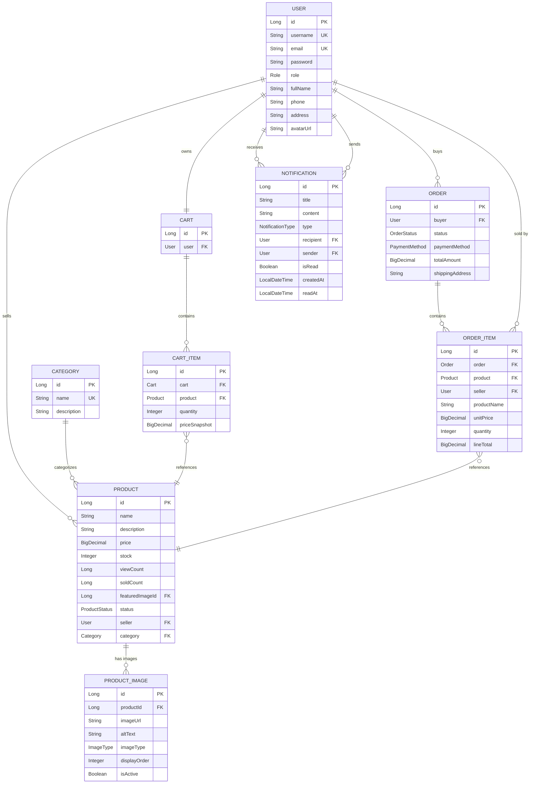

# SplitGo E-commerce ERD (Enhanced)

## Mermaid ER Diagram

## Key Relationships

1. **User Roles**: ADMIN, USER(buyer), SELLER
2. **Product Ownership**: Seller(User) 1 → * Product
3. **Product Images**: Product 1 → * ProductImage (main + gallery images)
4. **Shopping Flow**: User → Cart (1:1) → CartItem (*:*) → Product
5. **Order Flow**: Buyer(User) → Order (1:*) → OrderItem (*:*) → Product + Seller(User)
6. **Notifications**: User receives notifications from system/sellers
7. **Multi-seller Orders**: OrderItem links both product & seller

## Enums

- **Role**: ADMIN, USER, SELLER
- **ProductStatus**: ACTIVE, INACTIVE, DRAFT
- **OrderStatus**: PENDING, CONFIRMED, SHIPPED, DELIVERED, CANCELLED
- **PaymentMethod**: COD, BANK_TRANSFER, WALLET
- **NotificationType**: ORDER_UPDATE, SYSTEM, PROMOTION, SELLER_ALERT
- **ImageType**: MAIN, THUMBNAIL, GALLERY

## New Features Added

✅ **PRODUCT_IMAGE**: Supports main image + multiple gallery images with display order  
✅ **NOTIFICATION**: Complete notification system with read tracking  
✅ **Enhanced Enums**: More comprehensive status values for production use  

This enhanced ERD is now ready for scalable web development with image galleries and real-time notifications!